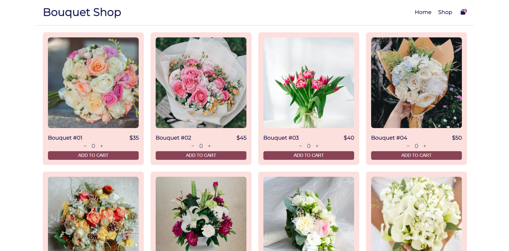

# Shopping Cart

Project for [TheOdinProject](https://www.theodinproject.com/courses/javascript/) JavaScript curriculum.

This project is a recreation of an online store to practice Routes in React. On the navigation bar, there are links that takes the user to specific paths (Home and Shop).

## Features

- Increase and decrease the item quantity with buttons
- Type the desired item quantity as an input.
- When an item is added to cart, the number of items in the cart is shown on the bag icon.

## Resources

- [React](https://reactjs.org/)
- [react-router-dom](https://reactrouter.com/web/guides/quick-start)
- [react-counter-input](https://www.npmjs.com/package/react-counter-input)
- [Webpack](https://webpack.js.org/)
- JavaScript, CSS and HTML
- Icons by [FontAwesome](https://fontawesome.com/)
- Images by [Unsplash](https://unsplash.com/)

## Demo

Live version [here](http://fernanda-veiga.github.io/shopping-cart)




## How to use

To use the website, click [here](http://fernanda-veiga.github.io/shopping-cart).

To use the code, download the files and, on the file's directory, type the following on the terminal:

```
npm install
npm run start
```
